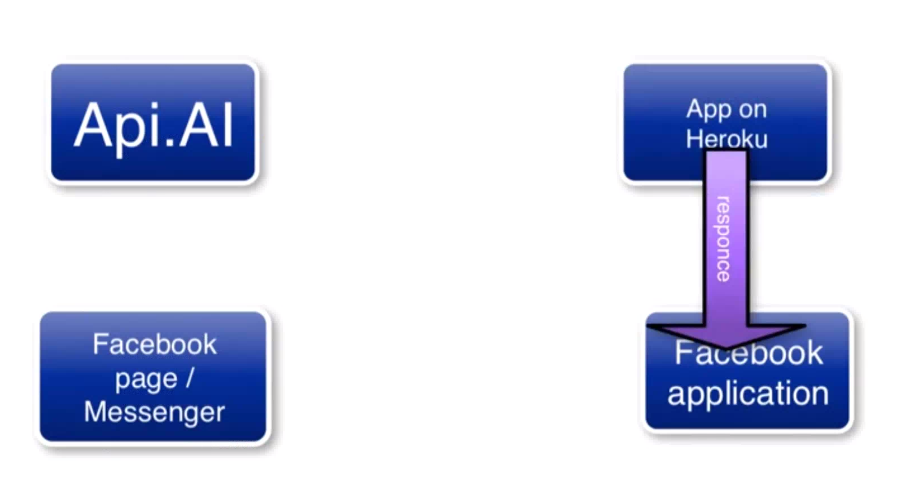

# What is a bot?

Bot is a software that automates things that we do.

# How to understand





# Three part


# What you'll need


# Connected Facebook Messenger Chat Bot

Reference official documents (https://developers.facebook.com/docs/messenger-platform/quickstart)

## Installation

```sh
npm install express request body-parser --save
```

## Download and Install Heroku

Heroku official(https://devcenter.heroku.com/articles/heroku-cli#download-and-install)

ex: (Debian/Ubuntu)

```sh
wget -qO- https://cli-assets.heroku.com/install-ubuntu.sh | sh
```

Login your heroku

```sh
heroku login
```

create your Procfile and add content in heroku execution

```sh
web: node index.js
```

### Deploy Code to Heroku

```sh
In Terminal type:
git status
git add .
git commit - -message ‘your message’
heroku create
git push heroku master
```

### Heroku root

```js
// Sets server port and logs message on success
app.listen(process.env.PORT || 1337, () => console.log("webhook is listening"));

// Index route
app.get("/", function(req, res) {
  res.send("Hello world, I am a chat bot");
});
```

# Example


## index.js

```javascript
// for Facebook verification
app.get("/webhook/", function(req, res) {
  /** UPDATE YOUR VERIFY TOKEN **/
  var VERIFY_TOKEN = "yourToken";

  // Parse params from the webhook verification request
  var mode = req.query["hub.mode"];
  var token = req.query["hub.verify_token"];
  var challenge = req.query["hub.challenge"];

  // Check if a token and mode were sent
  if (mode && token) {
    // Check the mode and token sent are correct
    if (mode === "subscribe" && token === VERIFY_TOKEN) {
      // Respond with 200 OK and challenge token from the request
      console.log("WEBHOOK_VERIFIED");
      res.status(200).send(challenge);
    } else {
      // Responds with '403 Forbidden' if verify tokens do not match
      res.sendStatus(403);
    }
  }
});
```

# Building a echo bot

1.  Setting token
2.  text echo ex: hi

```javascript
var PAGE_ACCESS_TOKEN = "yourToken";

// API End Point
app.post("/webhook/", function(req, res) {
  var body = req.body;

  if (body.object === "page") {
    // Iterate over each entry - there may be multiple if batched
    body.entry.forEach(function(entry) {
      // Get the webhook event. entry.messaging is an array, but
      // will only ever contain one event, so we get index 0

      // messaging_events = body.entry[0].messaging; // all messenger
      var webhook_event = entry.messaging[0];
      console.log(webhook_event);

      // Check if the event is a message or postback and
      // pass the event to the appropriate handler function

      if (webhook_event.message) {
        handleMessage(webhook_event);
      }
    });

    // Return a '200 OK' response to all events
    res.status(200).send("EVENT_RECEIVED");
  } else {
    console.log("EVENT_RECEIVED ERROR");
    res.sendStatus(404);
  }
});

// Sends response messages via the Send API
function callSendAPI(sender_psid, messageText) {
  //-------message echo (Automatic reply)
  var response = {
    text: messageText
  };

  var request_body = {
    messaging_type: "RESPONSE",
    recipient: {
      id: sender_psid
    },
    message: response
  };
  // Send the HTTP request to the Messenger Platform
  request(
    {
      uri: "https://graph.facebook.com/v2.6/me/messages",
      qs: { access_token: PAGE_ACCESS_TOKEN },
      method: "POST",
      json: request_body
    },
    (err, res, body) => {
      if (!err) {
        console.log("message sent!");
      } else {
        console.error("Unable to send message:" + err);
      }
    }
  );
  //-----------
}

// Handles messages events
function handleMessage(event) {
  var senderID = event.sender.id;
  var recipientID = event.recipient.id;
  var message = event.message;

  var messageText = message.text;
  var messageAttachments = message.attachments;

  console.log(
    "Received message for user %d and page %d at %d with message:",
    senderID,
    recipientID
  );

  if (messageText) {
    console.log("messageText: ", messageText);
    callSendAPI(senderID, messageText);
  }
}
```

# Example

  

# Building a bot use 3rd API

API.ai allows developers to integrate your app with the AI system with speech-to-text and natural language processing.

https://dialogflow.com/

* Document explanation:  
  https://dialogflow.com/docs/intents

```sh
$ npm install apiai
```

* Dashboard

# Create your agent and setting intents


# copy your api ai token


```js
var apiaiApp = require("apiai")("yourToken");
```

# Add api ai callback

```js
function callSendAPI(sender_psid, messageText) {
  //---------api ai
  let apiai = apiaiApp.textRequest(messageText, {
    sessionId: "yourSessionId" // use any arbitrary id
  });

  apiai.on("response", response => {
    // Got a response from api.ai. Let's POST to Facebook Messenger
    let aiText = response.result.fulfillment.speech;
    var request_body = {
      messaging_type: "RESPONSE",
      recipient: {
        id: sender_psid
      },
      message: { text: aiText } //--->aiText
    };
    console.log("****apiai.on***");
    request(
      {
        uri: "https://graph.facebook.com/v2.6/me/messages",
        qs: { access_token: PAGE_ACCESS_TOKEN },
        method: "POST",
        json: request_body
      },
      (err, res, body) => {
        if (!err) {
          console.log("message sent!");
        } else {
          console.error("Unable to send message:" + err);
        }
      }
    );
  });

  apiai.on("error", error => {
    console.log(error);
  });

  apiai.end();
}
```

# Webhook and post url


```js
var requestAsync = function(url) {
  // console.log('***url: ',url)
  return new Promise((resolve, reject) => {
    var req = request(url, (err, response, body) => {
      if (err) return reject(err, response, body);
      resolve(JSON.parse(body));
    });
  });
};

app.post("/ai", (req, res) => {
  console.log("*** Webhook for api.ai query ***");

  if (req.body.result.action === "stock") {
    // your intents action
    console.log("*** stock ***");
    let stock_number = req.body.result.parameters["stock-number"]; // you defined @sys-number value

    // Call 3rd API
    // Stock Name
    let restUrl =
      "http://203.67.19.12/XQWEB_UI/JVO2.aspx?&A=46&B=1&C=00331&P=AR" +
      stock_number +
      "&Lang=TW";
    // Stock Price
    let closeUrl =
      "http://203.67.19.12/XQWEB_UI/GETSTOCKPRICE.aspx?A=" +
      stock_number +
      ".TW&&Lang=TW";

    console.log("number**", stock_number);

    //----
    const urls = [restUrl, closeUrl];

    var getParallel = async function() {
      //transform requests into Promises, await all
      try {
        var data = await Promise.all(urls.map(requestAsync));
      } catch (err) {
        console.error(err);
      }

      console.log("***data: ", data);
      var msg;
      var DataNumber;
      var DataName;
      var mClose;

      //--
      try {
        DataNumber = data[0].rows[0].Row[0];
        DataName = data[0].rows[0].Row[1];
        mClose = data[1].mClose;
        console.log("***DataNumber && DataName && mClose");
        msg =
          "股票代碼: " +
          DataNumber +
          " " +
          "股票名稱: " +
          DataName +
          " " +
          "收盤價: " +
          mClose +
          " ";
      } catch (e) {
        console.log(e);
        console.log("***查無資料");
        msg = "查無資料";
      }
      //--

      return res.json({
        speech: msg,
        displayText: msg,
        source: "stock"
      });
    };

    getParallel();
  }
});
```

### You can get the data response


